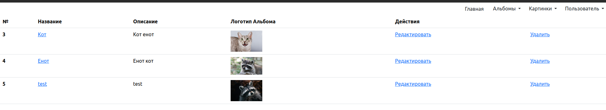
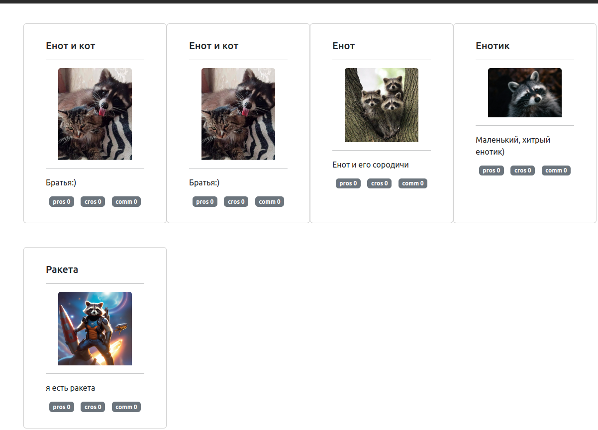
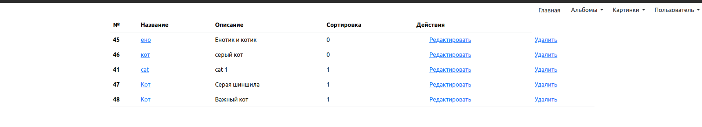
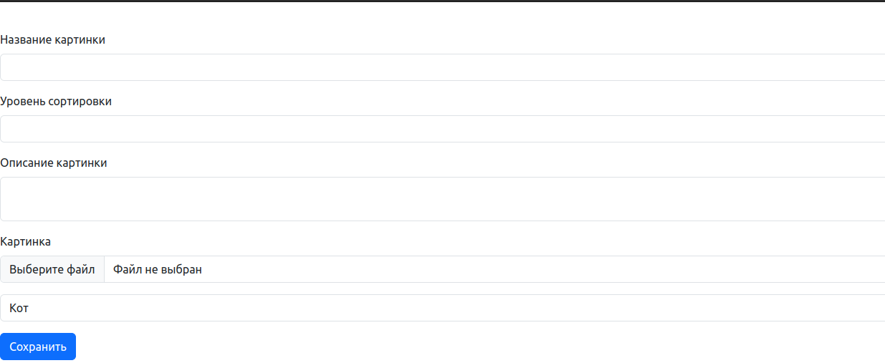
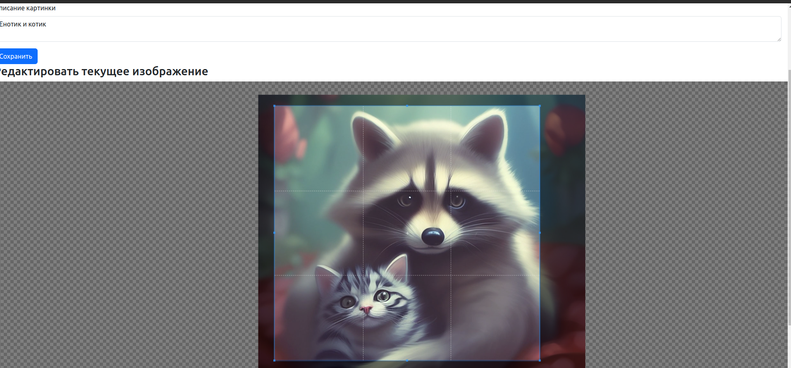

# TestTask
Tестовоt задание "Альбомы"

## Миграция БД
Дамп БД в src/migrations (формат sql)
Имя пользователя и пароль src/config/Config.php
```php
        'dsn' => 'mysql:dbname=testtask;host=localhost',
        'username' => 'testtask',
        'password' => '123456789Igor',
```
## Зависимости
В корне проекта 
```bash
    composer instal
```
Зависимости для фронта в /public/assets

```bash
    npm i
```
## Запуск с использованием dev сервера
Стандартный дев сервер запускать в корне /public
php -S 127.0.0.1:9000

## Результат
Список альбомов


Содержимое альбома

Редактирование альбома

Добавление картинки

Редактирование картинки
